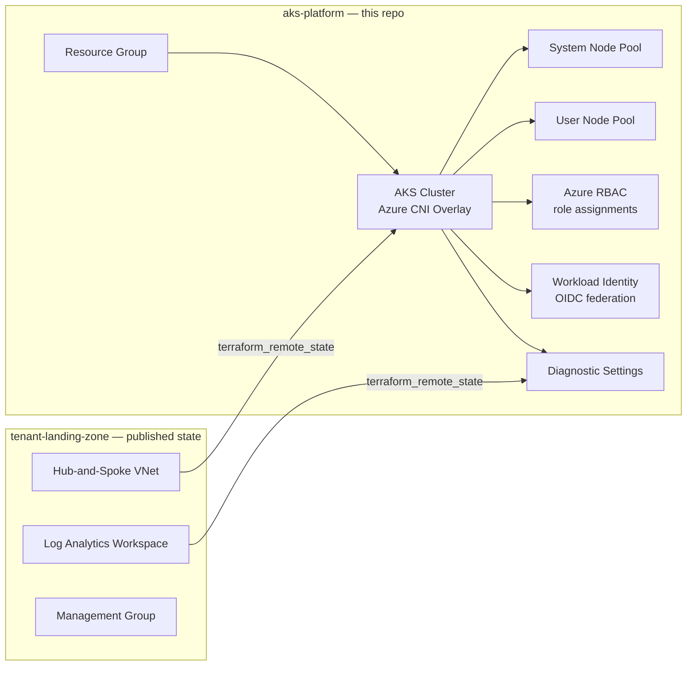

# aks-platform

Terraform module that provisions an Azure Kubernetes Service (AKS) cluster consuming network and governance context from [tenant-landing-zone](https://github.com/alozanowong/tenant-landing-zone) via remote state — not as a bolted-on child module, but as a separate repo reading another repo's published Terraform outputs. This mirrors how a platform team would actually structure an MSP-style landing zone: a shared foundation repo, and independent workload repos that consume it.

## Architecture Overview



`aks-platform` never has direct code coupling to `tenant-landing-zone` — no shared module, no provider aliasing across repos. The only connection is a `terraform_remote_state` data source reading `tenant-landing-zone`'s Azure Storage backend, read-only, at plan/apply time. The landing zone can be redeployed, re-organized, or owned by a different team entirely without this repo's code changing — only its `terraform.tfvars` inputs would need to catch up if a referenced output were renamed.

## What this demonstrates

| Capability | Implementation |
|---|---|
| Cross-repo Terraform composition | `terraform_remote_state` data source reading tenant-landing-zone's Azure Storage backend |
| Network isolation | Azure CNI Overlay — pod IPs don't consume VNet address space, avoiding the IP-exhaustion problem of plain Azure CNI |
| Workload separation | System node pool (`CriticalAddonsOnly` taint) isolated from a user node pool |
| Cluster access control | Entra ID + Azure RBAC for Kubernetes Authorization; access granted via `azurerm_role_assignment`, not static kubeconfig |
| Pod-level Azure auth | Azure AD Workload Identity — OIDC federation, no static secrets |
| Observability | AKS control-plane logs and metrics forwarded to the landing zone's shared Log Analytics workspace |
| CI | GitHub Actions: `terraform fmt -check`, `terraform validate`, `tflint` |

## Prerequisites

- tenant-landing-zone deployed first (this module reads its state)
- Terraform >= 1.5.0
- Azure CLI authenticated with access to the `stmspterraformstate` state storage account

## Usage

```bash
terraform init
terraform plan
terraform apply
```

Customize via a `terraform.tfvars` file — see `variables.tf` for the full list. Notably:

```hcl
aks_admin_group_object_ids = ["<entra-id-group-object-id>"]

aks_rbac_role_assignments = {
  "platform-team" = {
    principal_id = "<entra-id-group-object-id>"
    role         = "Cluster Admin"
  }
}

workload_identities = {
  "my-app" = {
    namespace             = "my-namespace"
    service_account_name  = "my-app"
  }
}
```

## Outputs

| Output | Description |
|---|---|
| `aks_cluster_id` | Resource ID of the AKS cluster |
| `aks_cluster_name` | Cluster name |
| `aks_oidc_issuer_url` | OIDC issuer URL for Workload Identity federation |
| `aks_kube_config_command` | `az aks get-credentials` command for this cluster |
| `workload_identity_client_ids` | Client IDs of provisioned workload identities |

## Related

- [tenant-landing-zone](https://github.com/alozanowong/tenant-landing-zone) — the Azure Landing Zone this repo consumes via remote state
